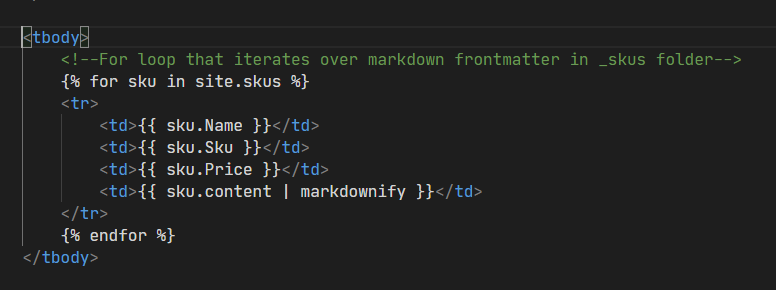
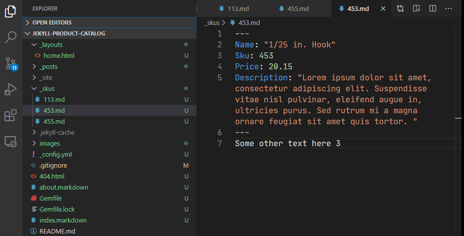

# jekyll-product-catalog
This repo builds a "flat" product catalog using jekyll to convert markdown frontmatter into product properties and information generated inside a responsive table

This jekyll site uses collections to iterate over markdown file front matter and populates that data in a table using the DataTables plug-in. This is a good set up for a business who wants to post information such as specs of parts used in manufacturing. It is a static site, so loading thousands of parts is as fast as possible, secure since there is no back end, and can be organized as the owner sees fit using the `_skus` folder as the repository for parts data. It also uses bulma css framework to look nice.

Here is what the FOR loop looks like that using Jekyll's Liquid engine:

And here is a look at one of the markdown files with it's frontmatter

